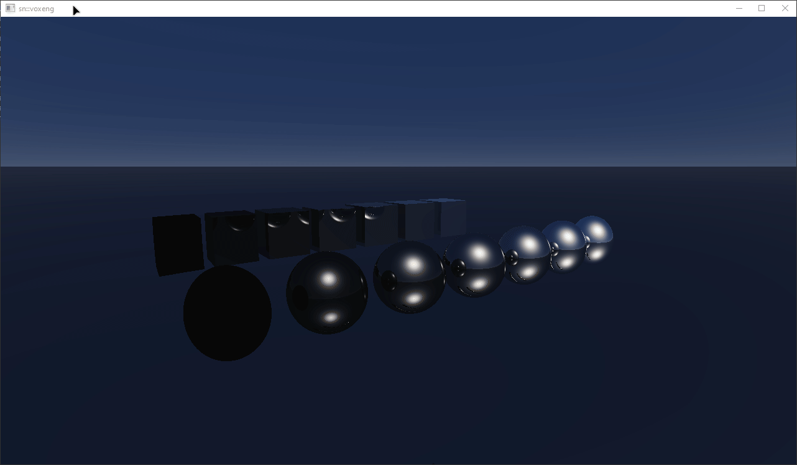

## 🚨 WIP | Read-Only Disclaimer 🚨
> **Warning**
> This project is still in active **"look, but don't touch"** mode: the API is unstable,
> things break and get redesigned without notice. Feel free to clone and build it —
> just don't expect a stable release yet.

# WIP | snvoxeng

Custom high-performance Vulkan-based voxel execution and rendering engine built from scratch.


*Current state: Analytic Ray Tracing with Perfect Specular Reflections, Procedural Atmospheric Skybox & Tonemapping (`2/pi * atan(x)` with gamma correction) implemented via Vulkan Compute pipeline.*

---

## Build

**Prerequisites:** Windows, Visual Studio 2022/2026 with the C++ workload
(MSVC v145 toolset), Git, [Vulkan SDK](https://vulkan.lunarg.com/sdk/home)
(the `app` project additionally uses GLFW via vcpkg).

> All commands below assume the repository is cloned and your shell is in its root:
>
> ```bat
> git clone https://github.com/snthedev/snvoxeng.git
> cd snvoxeng
> ```

### One-shot way

```bat
build.bat
```

`build.bat [Debug|Release]` does everything:

1. fetches dependencies into local folders on first run (skipped if present):
   * GoogleTest v1.17.0 → `tests\thirdparty\`
   * [cstrs](https://github.com/snthedev/cstrs) → `thirdparty\cstrs`
   * [snassert](https://github.com/snthedev/snassert) → `thirdparty\snassert`
2. locates MSBuild via `vswhere`;
3. builds the engine library, the test suite **and the demo app** (x64);
4. runs the tests.

> The demo app (`build\app-d.exe`) is built but never launched by the script.
> GLFW for the app is restored automatically via the vcpkg manifest
> (`app\vcpkg.json`) on the first build.

`build.bat fetch` only pulls the dependencies without building.

### Manual equivalent

```powershell
git clone --depth 1 --branch v1.17.0 https://github.com/google/googletest.git tests\thirdparty\googletest
git clone https://github.com/snthedev/cstrs.git thirdparty\cstrs
git clone https://github.com/snthedev/snassert.git thirdparty\snassert

$msbuild = & "${env:ProgramFiles(x86)}\Microsoft Visual Studio\Installer\vswhere.exe" `
    -latest -prerelease -products * -requires Microsoft.Component.MSBuild `
    -find MSBuild\**\Bin\MSBuild.exe | Select-Object -First 1

& $msbuild snvoxeng\snvoxeng.vcxproj /p:Configuration=Debug /p:Platform=x64 /p:SolutionDir="$PWD"
& $msbuild tests\tests.vcxproj     /p:Configuration=Debug /p:Platform=x64 /p:SolutionDir="$PWD"
build\tests-d.exe
```

### Project layout

```
snvoxeng/
├── build.bat                  # one-shot deps fetch + engine/tests build + test runner
├── snvoxeng.slnx              # solution (engine lib, app, tests)
├── snbcg/bcg.hpp              # vendored xmacro-based builder-codegen core
├── snvoxeng/
│   ├── .def/vk/*.h            # declarative Vulkan object definitions (xmacro tables)
│   ├── .src/vk/*.cpp          # implementations of the generated builders
│   ├── snvoxeng/vk/*.hpp      # generated fluent Builder classes
│   └── snvoxeng/Renderer.hpp  # handwritten high-level layer (frame loop, sync)
├── app/main.cpp               # GLFW demo application (the ray tracing showcase)
└── tests/                     # headless googletest suite
```

---

## Roadmap & Current Progress

The up-to-date and detailed project roadmap, including all design specifics, is always available on our Discord server:  
📢 **[Join our Discord](https://discord.gg/9HsRDdFBFV)**

### 📍 Current Stage: **Milestone 3: Analytical Ray Marching (Math Foundations)**
* [x] Passing camera parameters to the compute shader via Push Constants
* [x] Iterative Ray Tracing loop with multi-bounce reflections
* [x] Custom analytical intersection testing for Spheres and AABBs (Cubes)
* [x] Dynamic atmospheric skybox model (Rayleigh/Mie scattering & sun disc simulation)
* [x] Custom Tonemapping and Gamma Correction Pipeline
* [ ] Integrating VMA into the project
* [ ] Passing camera parameters to the compute shader via UBO.
* [ ] **Milestone Result:** A smooth 3D sphere rendered on screen that can be fully navigated with a free camera.

---

## 🛠️ Next Steps
* Finalize VMA pipeline integration for buffers/images.
* Implement basic abstractions and tools for UBO management.
