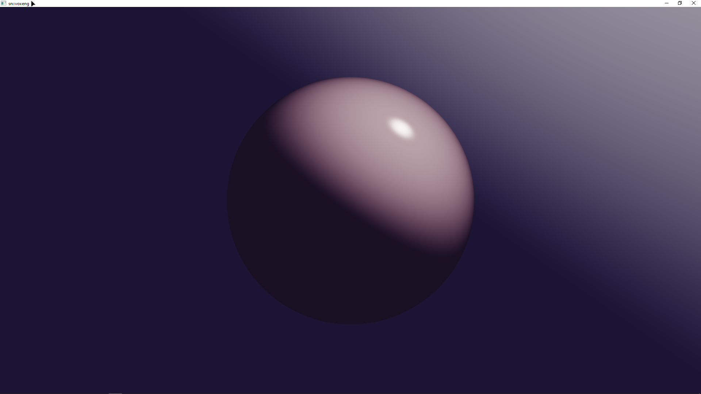

## 🚨 WIP | Read-Only Disclaimer 🚨
> **Warning**
> At the moment, this project is in **"look, but don't touch"** mode. Attempting to clone and build this repository right now is guaranteed to trigger an existential crisis in your compiler due to the absence of external private dependencies `snassert` and `cstrs` on GitHub. Building is strictly reserved for the chosen one (me).

# WIP | snvoxeng

Custom high-performance Vulkan-based voxel execution and rendering engine built from scratch.

 
*Current state: Raymarching & Tone Mapping (2/pi * atan(x) with 2.2 gamma correction) implemented via Vulkan Compute pipeline.*

---

## Roadmap & Current Progress

The up-to-date and detailed project roadmap, including all design specifics, is always available on our Discord server:  
📢 **[Join our Discord](https://discord.gg/9HsRDdFBFV)**

### 📍 Current Stage: **Milestone 2: Compute Pipeline & Screen Space (The First Pixel)**
* [x] **VRAM Storage Image**: Create a container frame in VRAM for the compute shader to write its output into.
* [x] **Procedural Compute Shader**: Write a basic Compute Shader that generates a procedural image (Ray-traced sphere with Blinn-Phong lighting and tone mapping).
* [x] **Memory Barriers & Synchronization**: Set up Memory Barriers for proper queue synchronization (Compute Shader writes -> Swapchain reads and presents).
* [x] **The First Pixel on Screen**: Output the compute-generated texture directly to the Swapchain.
* [x] **Milestone Result**: A bare window where the GPU generates a procedural image completely free of vertex buffers in real-time.

---

## Next Steps | Milestone 3
* Pass camera parameters (position, view vector, transformation matrices) into the Compute Shader.
* Implement a ray generation algorithm for each screen pixel.
* Write a core Ray Marching loop to intersect rays with basic analytical shapes (sphere, plane) via Signed Distance Functions (SDF).
* Implement simple Lambertian (diffuse) lighting to visualize the shape and depth.
* Milestone Result: A smooth 3D sphere rendered on screen that can be fully navigated with a free camera.
